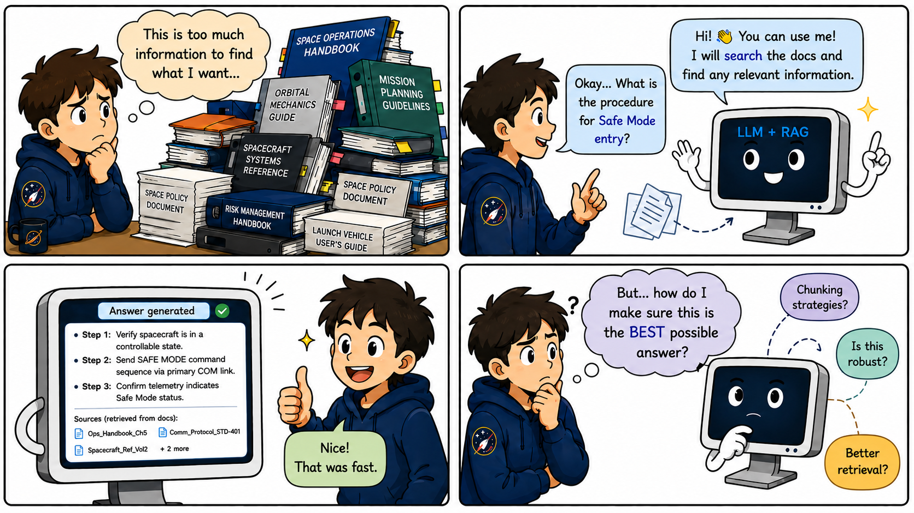
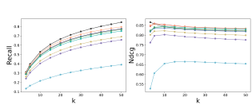
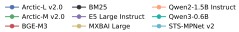

<h1 align="center">
A Systematic Evaluation of Retrieval-Augmented Generation and Language Models for Space Operations
</h1>

<p align="center">
  Ruben Belo* · Marta Guimarães · Cláudia Soares
</p>

<p align="center">
  NOVA LINCS &nbsp;·&nbsp; Neuraspace &nbsp;·&nbsp; Technical University of Munich
</p>

<p align="center">
  <a href="paper.pdf">[Paper]</a> &nbsp;|&nbsp; <a href="assets/poster.pdf">[Poster]</a>
</p>

---

## Overview

Space operations generate vast, heterogeneous documentation that engineers and operators must navigate under time pressure. This paper systematically evaluates **Retrieval-Augmented Generation (RAG) pipelines** for the space domain, comparing retrieval strategies, embedding models, rerankers, and LLM answer quality to assess accuracy, relevance, and reliability.



---

## Evaluating Retrieval Models

### Validating Rerankers

We evaluate three rerankers—BGE-M3, GTE reranker-base, and Jina reranker-v2—to ensure robust and unbiased relevance scoring.

Instead of relying on a single model, we use an ensemble of rerankers to reduce systematic bias and avoid overfitting to any specific embedding–reranker pairing. This is especially important since some rerankers are trained in ecosystems closely tied to specific embedding models.

<p align="center">
  
</p>

Across both Golden-Offset and Golden-Aligned subsets, all rerankers perform strongly, with consistently high F1 and accuracy scores (Table 1). This suggests that the relevance signal is stable and reliable, making these models suitable for downstream evaluation of retrieval quality.

---

### Embedding Model Evaluation

We evaluate eight state-of-the-art embedding models from the MMTEB leaderboard, alongside BM25 as a classical sparse baseline.

For each method, we retrieve the top-50 passages per query. To approximate ground truth, we first retrieve the top-100 using BM25, then rerank them using the ensemble of rerankers to build a cleaner relevance signal.

We report Recall and NDCG across multiple top-k values, using two chunk sizes (2000 and 512 tokens) to study the effect of document granularity.

<p align="center">
  
</p>

<p align="center">
  
</p>

Overall trends are consistent across both settings. BM25 remains a strong baseline in terms of recall and efficiency, while dense models like BGE-M3 and Qwen-based retrievers perform competitively in ranking quality (especially NDCG).

A key takeaway is that the best model depends on the pipeline setup:

- **Retriever + reranker pipelines** benefit most from high-recall, low-latency models like BM25.
- **Retriever-only pipelines** benefit more from strong ranking quality (NDCG), where dense models tend to perform better.

  
---

### Impact of Reranking and Chunk Size Analysis

Previous work evaluates passage relevance using chunks up to 2000 tokens, often relying on LLM-based judges such as :contentReference[oaicite:1]{index=1} 3.3 70B. This follows established evaluation frameworks like RAGAS and recent agentic retrieval approaches where LLMs act as evaluators or “judges”.

We extend this setup by also evaluating 512-token chunks to understand whether reranking improves retrieval quality across different passage granularities.

Each question–passage pair is scored using a 0–3 relevance scale:
- 0 = completely irrelevant  
- 1 = slightly relevant  
- 2 = moderately relevant  
- 3 = highly relevant  

We evaluate four Top-K settings (3, 5, 7, 10) under both chunk sizes.

<p align="center">
  
</p>

---

### Key Findings

**1. Reranking consistently improves relevance distribution**

Across all Top-K settings and chunk sizes, reranking reduces low-relevance passages (scores 0 and 1) and increases highly relevant ones (score 3).

For example, at Top-3 (2000-token setting):
- Score 0 drops from 2.12% → 1.29%
- Score 3 increases from 39.66% → 44.76%

A similar pattern appears in the 512-token setting:
- Score 0 drops from 1.48% → 0.73%
- Score 3 increases from 42.54% → 48.37%

This shows reranking reliably filters out noise and promotes highly relevant passages.

---

**2. Moderate relevance behaves differently under reranking**

Retriever outputs tend to include slightly more mid-relevance (score 2) passages, especially at lower Top-K values. Reranking reduces these in favor of higher-confidence selections, suggesting it is most effective when pruning uncertain or borderline content.

---

**3. Chunk size affects relevance distribution**

- 2000-token chunks tend to produce slightly higher proportions of score-2 passages.
- 512-token chunks consistently yield more score-3 (high relevance) outputs.

This supports the intuition that shorter chunks reduce noise and improve precision of top-ranked results.

---

### Overall Insight

The combination of reranking + 512-token chunking produces the most consistent improvement in retrieval quality.

In practice, this suggests:
- Smaller, more focused chunks improve retrieval precision
- Reranking amplifies this effect by filtering noise and boosting top-relevance results
- The best setup is not just model-dependent, but also strongly influenced by chunk granularity


## 6. Evaluating LLM Answer Accuracy on SpaceQA

### 6.1 Results

We evaluate answer accuracy using the ESA SpaceQA dataset, originally introduced by Garcia-Silva et al. and previously used to benchmark open-domain question answering in the space domain.

The dataset contains 60 question–passage–answer triplets covering ESA mission documentation, including mission design, payloads, operations, and risk assessment. Although not fully aligned with our primary focus on space debris mitigation, it provides a strong benchmark for testing domain-specific reasoning in space operations.

We test whether :contentReference[oaicite:0]{index=0} can produce correct answers under both clean and noisy retrieval settings.

---

### Setup

For each question, we provide the correct supporting passage and add four random in-domain distractor passages (from the 2000-token pool), creating a high-noise retrieval setting.

This increases the ratio of irrelevant to relevant context and stress-tests the model’s ability to extract useful information.

We evaluate:

- **Answer Accuracy** (exact match with ground truth)
- **Answer Faithfulness**
- **Answer Relevance**
- **Noise Robustness**

The last three metrics are computed using an ensemble of judge models (:contentReference[oaicite:1]{index=1} and :contentReference[oaicite:2]{index=2}), following standard RAG evaluation practices. All scores are on a 1–5 scale.

---

### Key Results

The model performs strongly overall:

- **Faithfulness:** 3.92  
- **Relevance:** 4.02  
- **Noise robustness:** 4.52  
- **Answer accuracy:** 56 / 60  
- **Accuracy without context:** 3 / 60  

This shows a clear result: retrieval context is critical. Without RAG, performance collapses, while with context the model consistently produces correct answers.

---

### Interpretation

The high faithfulness and relevance scores indicate that the model stays grounded in the provided passages and aligns well with the questions.

The strong noise robustness score suggests that even with multiple irrelevant passages added, the model is still able to extract the correct information most of the time.

However, errors still occur in cases where the correct answer is only implicitly stated. In these cases, the model tends to avoid guessing and instead defaults to “not found in context,” prioritizing safety over inference.

This reduces hallucinations but limits performance when answers require bridging implicit relationships across the text.

---

### Takeaway

Overall, the LLM performs well in noisy retrieval settings, but its main limitation is not noise—it is **implicit reasoning**. When answers are not explicitly stated, the model is conservative and often fails to infer them.

Given the small dataset size (60 examples), these results should be interpreted as indicative rather than conclusive.

## Conclusion

In this work, we systematically evaluate the main components of modern RAG pipelines in the space domain.

We benchmark eight state-of-the-art embedding models alongside BM25, evaluate retrieval with and without reranking, and analyze the impact of chunk size on retrieval quality. Across experiments, reranking consistently improves relevance quality, while smaller 512-token chunks produce cleaner and more precise retrieval outputs.

We also evaluate answer generation under noisy retrieval conditions using multiple complementary metrics, ranging from answer relevance and faithfulness to robustness against corrupted context. Additionally, we extend previous datasets with new relevant/irrelevant passage triplets to support retrieval evaluation.

Overall, the results show that current retrieval and language models are increasingly capable of supporting controlled deployment in space operations workflows. Some retrievers and rerankers demonstrate particularly strong performance, while the LLM remains robust even under highly noisy retrieval settings.

---

#Limitations

While the results are promising, several limitations should be considered.

The SpaceQA dataset contains only 60 question–answer pairs, which limits large-scale statistical conclusions. The results should therefore be interpreted as indicative rather than definitive. Future work could explore synthetic or augmented datasets to expand evaluation coverage.

Our negative sampling strategy may also produce passages that are relatively easy to distinguish from relevant ones. Constructing harder and more ambiguous negatives would provide a more challenging retrieval benchmark.

In addition, reranker outputs are used as proxy ground truth. Although we mitigate bias through reranker ensembles, future evaluations could incorporate human annotations or stronger LLM-based judging strategies.

Finally, answer quality metrics rely on judge models such as :contentReference[oaicite:0]{index=0} and :contentReference[oaicite:1]{index=1}. While these systems provide strong automated evaluation signals, alignment with human judgment remains an open challenge in RAG evaluation research.


## Citation

```bibtex
@inproceedings{belo2026rag,
  title     = {A Systematic Evaluation of Retrieval-Augmented Generation and Language Models for Space Operations},
  author    = {Belo, Ruben and Guimarães, Marta and Soares, Cláudia},
  booktitle = {CVPR Workshop},
  year      = {2026}
}
```

---

<p align="center">
  Supported by <a href="https://nova-lincs.di.fct.unl.pt/">NOVA LINCS</a> (FCT IP, UID/04516) and the Neuraspace AI Fights Space Debris project (co-funded by Recovery and Resilience Plan and NextGenerationEU).
</p>
